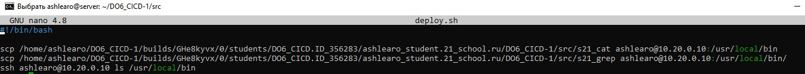

## Part 1. Настройка gitlab-runner

**Поднять виртуальную машину Ubuntu Server 20.04 LTS**

**Скачать и установить на виртуальную машину gitlab-runner**

**Установка GitLab Runner**

В репозиториях доступна версия 11.2.0 gitlab-runner,
поэтому установка по инструкции из GitLab:  
<https://docs.gitlab.com/runner/install/linux-manually.html>

1. Загружаем двоичный файл для нашей системы:  
**`sudo curl -L --output /usr/local/bin/gitlab-runner "https://gitlab-runner-downloads.s3.amazonaws.com/latest/binaries/gitlab-runner-linux-amd64"`**

2. Даем ему разрешения на выполнение:  
**`sudo chmod +x /usr/local/bin/gitlab-runner`**

3. Создаем пользователя GitLab CI:  
**`sudo useradd --comment 'GitLab Runner' --create-home gitlab-runner --shell /bin/bash`**

4. Установка и запуск от имени службы:  
**`sudo gitlab-runner install --user=gitlab-runner --working-directory=/home/gitlab-runner`**

5. Проверяем версию:  
**`sudo gitlab-runner -version`**

**Запустить gitlab-runner и зарегистрировать его для использования в текущем проекте (DO6_CICD)**  

Запуск службы и добавление её в автозагрузку, выполнив команду:   
**`sudo systemctl enable --now gitlab-runner`**
проверка, что служба запустилась:   
**`sudo systemctl status gitlab-runner`**

Register a runner, в системе Ubuntu, выполнив команду:   
**`sudo gitlab-runner register`** 
- далее идет запрос данных, вписываем URL и token, остальные поля можно оставить пустыми, в последнее поле записываем  **`shell`**  

на страничке Школы 21 - в проекте CICD, копируем поочередно URL и token  

## Предварительно установить make, gcc, и clang-format
sudo apt install make

sudo apt install gcc

sudo apt install clang-format

## Part 2. Сборка

**Написать этап для CI по сборке приложений из проекта C2_SimpleBashUtils:**  
**В файле .gitlab-ci.yml добавить этап запуска сборки через мейк файл из проекта C2**  
**Файлы, полученные после сборки (артефакты), сохранять в произвольную директорию со сроком хранения 30 дней.**  

**Создаём файл .gitlab-ci.yml в корне проекта и вписываем туда первую стадию build, путь и время храннения скомпилированных файлов (артефактов):**

Добавляем в проект все файлы по cat и grep из проекта SimpleBash  

делаем в проекте какое нибудь изменение затем коммитим и пушим:   

git add .

git commit -am "..."

git push origin develop

наш Pipeline на паузе висит, ждет команду

запускаем runner, выполнив команду **`sudo gitlab-runner run`**

видим, что Pipeline заработал меняются статусы

### Артефакты сохранились

## Part 3. Тест кодстайла

**Написать этап для CI, который запускает скрипт кодстайла (clang-format):**  
**Если кодстайл не прошел, то "зафейлить" пайплайн**  
**В пайплайне отобразить вывод утилиты clang-format**  

Добавляем этап style в заголовке .gitlab-ci.yml , и ставим задачу по кодстайлу:  

Запушил, проверяю:  

Теперь добавляем ошибки по кодстайлу в файлы s21_cat s21_grep, пушим и смотрим результат:  

пайплайн - фейлит  

  

## Part 4. Интеграционные тесты

**Написать этап для CI, который запускает ваши интеграционные тесты из того же проекта:**  
**Запускать этот этап автоматически только при условии, если сборка и тест кодстайла прошли успешно**  
**Если тесты не прошли, то "зафейлить" пайплайн**  
**В пайплайне отобразить вывод, что интеграционные тесты успешно прошли / провалились**  

Дописываем этап test в заголовок .gitlab-ci.yml   

Ставим задачу по тесту:  

Проверка, если сборка и тест кодстайла не прошли успешно - то этап test не запускается:  

Другой случай - сборка и тест кодстайла прошли успешно.
Пушим, и смотрим результат, что все этапы успешно отработали:  

Другой случай - специально портим функции cat и grep - чтоб тесты не прошли.  
Пушим, смотрим результат, что тесты провалились:  

## Part 5. Этап деплоя

**Поднять вторую виртуальную машину Ubuntu Server 20.04 LTS**

Изменяю настройки адаптеров на двух машинах:  

Изменяю файл etc/netplan/00-installer-config.yaml для каждой машины,     
ip 10.20.0.20  Ubuntu_for_CICD    - рабочая машина с нее пушим проект       
ip 10.20.0.10  Ubuntu_for_deploy  - машина, принимающая развернутый проект, в случае успеха     

Проверяем соединение между машинами:  

**Написать этап для CD, который "разворачивает" проект на другой виртуальной машине:**
**Запускать этот этап вручную при условии, что все предыдущие этапы прошли успешно**

Добавляем этап deploy в заголовок .gitlab-ci.yml

Ставим задачу по deploy:

**Написать bash-скрипт, который при помощи ssh и scp копирует файлы, полученные после сборки (артефакты), в директорию /usr/local/bin второй виртуальной машины**

Зададим нужные привилегии пользователю gitlab-runner - добавим его в группу sudo и разрешим запуск команд без пароля, выполнив команду:  
**`sudo usermod -aG sudo gitlab-runner`**

меняем строки в файле /etc/sudoers, используя команду:   
**`sudo visudo`**

Делаем подключение ко второй машине через ssh без необходимости ввода пароля:

c Ubuntu_for_CICD захожу на вторую машину Ubuntu_for_deploy через ssh, выполнив команду   
**`ssh 10.20.0.20`**
Далее находясь на второй машине, захожу изменяю настройки в конфиг. файле (ставлю поключение по публичному ключу) выполнив команду   
**`sudo vim /etc/ssh/sshd_config`**

перезапускаем сервер ssh выполнив команду  
**`sudo service ssh restart`**

Затем, именно на Ubuntu_for_CICD генерируем ключ  **`sudo -u root ssh-keygen`**
((используем "sudo -u root" т.к.от пользователя root выполняется действие, раннер от рута работает, поэтому надо от него ключи создать и перекинуть))

и скопируем его на вторую машину командой   
**`sudo -u root ssh-copy-id ashlearo@10.20.0.10`**

Теперь подключаемся на вторую машину Ubuntu_for_deploy через ssh без пароля

дадим права для папки /usr/local/bin/ на машине Ubuntu_for_deploy выполнив команду   
**`sudo chmod -R 777 /usr/local/bin`**

Снова пушим и видим, что стадия деплой ждёт ручного запуска:

Деплой прошёл успешно, файлы появились в нужной папке на второй машине:

## Part 6. Дополнительно. Уведомления

Настроить уведомления о успешном/неуспешном выполнении пайплайна через бота с именем "[ваш nickname] DO6 CI/CD" в Telegram

Пишу @botfather, чтобы создать бота и получить его токен

Пишу @getmyid_bot, чтобы узнать свой ID telegram

Запускаю бота, и пишу в чате созданому боту "ashlearo_d06_CICD_bot" команду:  
**`/start`**

В скрипте notifications.sh  прописываем токен и ID telegram

После каждой стадии добавляем в .gitlab-ci.yml вызов скрипта ./notifications.sh 

Пушим, получаем уведомления от бота - всё работает

